# ITC Sewage Treatment Plant — process flow

> **Generated.** Do not edit this file by hand — run `npm run plant:flow`.
> Every block, line and number below is derived from
> `backend/src/plants/itcStp/flowsheet.js`, so the drawing cannot say anything
> the plant model does not.

Client **ITC** · Contractor **Safekrite** · Sub-contractor **Infercon Automation**

Design flow **675 KLD** · 39 unit operations · 46 streams

The sheet below is a **PFD, not a P&ID**: valves and instruments are summarised
on the line they sit on, because they belong on the P&ID and all 339 of them are
already specified in the I/O schedule. Flows are the steady-state solution, not
nameplate figures.

A printable version of the same sheet: [`itc-stp-pfd.svg`](itc-stp-pfd.svg).

## The flow

```mermaid
flowchart LR
  subgraph ELP["1. Feed Water Process"]
    in_kitchen(["IN-K<br/>Kitchen influent"])
    ogt["OGT<br/>Oil & grease trap"]
    in_sewage(["IN-S<br/>Sewage influent"])
    in_laundry(["IN-L<br/>Laundry influent"])
    ct["CT<br/>Collection tank"]
    elp_p[["ELP<br/>Effluent lifting pump"]]
    eqt["EQT<br/>Equalisation tank"]
  end
  subgraph RFP["2. Reactor Feed Pump Process"]
    rfp_p[["RFP<br/>Reactor feed pump"]]
  end
  subgraph R["3. Reactor Process"]
    blowers[["B-301<br/>Air blowers ×3"]]
    r1["R1<br/>Reactor 1"]
    r2["R2<br/>Reactor 2"]
    stp_p[["STP<br/>Sludge transfer pump"]]
  end
  subgraph SHT["4. Sludge Process"]
    sht["SHT<br/>Sludge holding tank"]
    poly_dose{{"PD-411<br/>Poly dosing"}}
    centrifuge[["CFG-421<br/>Decanter centrifuge"]]
    solids_out(["CAKE<br/>Solid discharge"])
  end
  subgraph FFP["5. Filter Feed Pump Process"]
    int_wt["INT-WT<br/>Intermediate water tank"]
    cl_dose{{"CD-501<br/>0.5 to 1 ppm"}}
    ffp_p[["FFP<br/>Filter feed pump"]]
  end
  subgraph ACF["6. ACF and MGF Filter Process"]
    acf["ACF<br/>Activated carbon filter"]
    mgf["MGF<br/>Multigrade filter"]
  end
  subgraph SFP["7. Softener Feed Process"]
    sfp_p[["SFP<br/>Softener feed pump"]]
    sof["SOF<br/>Softener"]
    reject_out(["RJT<br/>Regeneration reject"])
  end
  subgraph UF["8. Ultrafiltration Feed Pump Process"]
    mf["MF<br/>Micron filter"]
    uffp[["UFFP<br/>UF feed pump"]]
    uf["UF<br/>Ultrafiltration"]
    sintex["SNT<br/>1000 L"]
    ufbp[["UFBP<br/>UF backwash pump"]]
  end
  subgraph HWTP["9. Horticulture Water T/F Pump Process"]
    irr_wt["IRR-WT<br/>Irrigation water tank"]
    hwtp[["HWTP<br/>Horticulture transfer pump"]]
    irrigation(["IRR-SYS<br/>Irrigation system"])
  end
  subgraph FWTP["10. Flushing Water T/F Pump Process"]
    fwt["FWT<br/>Flush water tank"]
    fwtp[["FWTP<br/>Flushing water transfer pump"]]
    flush_out(["FW-SYS<br/>Flushing water system"])
  end
  subgraph SWTP["11. Soft Water T/F Pump Process"]
    swt["SWT<br/>Soft water tank"]
    swt_cl{{"CD-1101<br/>SWT Cl₂ dosing"}}
    swtp[["SWTP<br/>Soft water transfer pump"]]
    cooling_tower(["CLG-TWR<br/>Cooling tower"])
  end
  in_kitchen -->|"1 · 100 m³/d"| ogt
  in_sewage -->|"2 · 150 mm · 475 m³/d"| eqt
  blowers -->|"3 · 125 mm"| r1
  blowers -->|"4 · 125 mm"| r2
  in_laundry -->|"5 · 100 m³/d"| ct
  ogt -->|"6 · 150 mm · 99.9 m³/d"| eqt
  ct -->|"7 · 50 mm · 100 m³/d"| elp_p
  elp_p -->|"8 · 65 mm · 100 m³/d"| eqt
  eqt -->|"9 · 100 mm · 714.1 m³/d"| rfp_p
  rfp_p -->|"10 · 100 mm · 357.1 m³/d"| r1
  rfp_p -->|"11 · 100 mm · 357.1 m³/d"| r2
  r1 -->|"12 · 80 mm · 288.2 m³/d"| int_wt
  r1 -->|"13 · 80 mm · 13.3 m³/d"| stp_p
  r2 -->|"14 · 80 mm · 288.2 m³/d"| int_wt
  r2 -->|"15 · 80 mm · 13.3 m³/d"| stp_p
  stp_p -->|"16 · 80 mm · 13.3 m³/d"| sht
  int_wt -->|"17 · 100 mm · 576.4 m³/d"| cl_dose
  sht -->|"18 · 50 mm · 13.3 m³/d"| poly_dose
  cl_dose -->|"19 · 100 mm · 576.4 m³/d"| ffp_p
  poly_dose -->|"20 · 50 mm · 13.3 m³/d"| centrifuge
  ffp_p -->|"21 · 100 mm · 317 m³/d"| acf
  ffp_p -->|"22 · 100 mm · 201.8 m³/d"| mf
  ffp_p -->|"23 · 100 mm · 57.6 m³/d"| irr_wt
  centrifuge -.->|"24 · 50 mm · 13.1 m³/d"| eqt
  centrifuge -->|"25 · 50 mm · 0.3 m³/d"| solids_out
  acf -.->|"26 · 80 mm · 6 m³/d"| eqt
  acf -->|"27 · 80 mm · 311 m³/d"| mgf
  mf -->|"28 · 50 mm · 201.7 m³/d"| uffp
  mgf -.->|"29 · 80 mm · 5 m³/d"| eqt
  mgf -->|"30 · 100 mm · 183.6 m³/d"| sfp_p
  mgf -->|"31 · 80 mm · 122.4 m³/d"| irr_wt
  uffp -->|"32 · 50 mm · 201.7 m³/d"| uf
  sfp_p -->|"33 · 100 mm · 183.6 m³/d"| sof
  irr_wt -->|"34 · 100 mm · 180.1 m³/d"| hwtp
  uf -->|"35 · 50 mm · 201.7 m³/d"| sintex
  sof -->|"36 · 100 mm · 5.4 m³/d"| reject_out
  sof -->|"37 · 100 mm · 178.2 m³/d"| swt
  hwtp -->|"38 · 100 mm · 180.1 m³/d"| irrigation
  sintex -->|"39 · 50 mm · 186.6 m³/d"| fwt
  sintex -->|"40 · 50 mm · 15.1 m³/d"| ufbp
  swt -->|"41 · 100 mm · 178.2 m³/d"| swt_cl
  ufbp -.->|"42 · 50 mm · 15.1 m³/d"| eqt
  fwt -->|"43 · 100 mm · 186.6 m³/d"| fwtp
  swt_cl -->|"44 · 100 mm · 178.2 m³/d"| swtp
  fwtp -->|"45 · 100 mm · 186.6 m³/d"| flush_out
  swtp -->|"46 · 100 mm · 178.2 m³/d"| cooling_tower
```

## Stream table

Keyed to the circled numbers on the SVG sheet.

| # | From | To | Service | Size | m³/d | TSS | BOD | TN | TP | pH | In line |
| --: | --- | --- | --- | --: | --: | --: | --: | --: | --: | --: | --- |
| 1 | IN-K | OGT | Raw sewage | — | 100 | 500 | 600 | 50 | 10 | 6.5 | — |
| 2 | IN-S | EQT | Raw sewage | 150 mm | 475 | 260 | 220 | 45 | 8 | 7.2 | — |
| 3 | B-301 | R1 | Process air | 125 mm | — | — | — | — | — | — | — |
| 4 | B-301 | R2 | Process air | 125 mm | — | — | — | — | — | — | — |
| 5 | IN-L | CT | Raw sewage | — | 100 | 150 | 250 | 15 | 15 | 9 | — |
| 6 | OGT | EQT | Raw sewage | 150 mm | 99.9 | 455 | 523.5 | 50 | 10 | 6.5 | — |
| 7 | CT | ELP | Raw sewage | 50 mm | 100 | 150 | 250 | 15 | 15 | 9 | ELP inlet valves (2) |
| 8 | ELP | EQT | Raw sewage | 65 mm | 100 | 150 | 250 | 15 | 15 | 9 | ELP outlet valves (2) |
| 9 | EQT | RFP | Raw sewage | 100 mm | 714.1 | 268.9 | 256.3 | 40.3 | 9.14 | 7.36 | RFP inlet valves (2) |
| 10 | RFP | R1 | Raw sewage | 100 mm | 357.1 | 268.9 | 256.3 | 40.3 | 9.14 | 7.36 | RFP outlet valves (2), Reactor feed flow |
| 11 | RFP | R2 | Raw sewage | 100 mm | 357.1 | 268.9 | 256.3 | 40.3 | 9.14 | 7.36 | RFP outlet valves (2), Reactor feed flow |
| 12 | R1 | INT-WT | Treated water | 80 mm | 288.2 | 20 | 1.3 | 32.9 | 8.41 | 7.26 | — |
| 13 | R1 | STP | Sludge | 80 mm | 13.3 | 3500 | 1750 | 40 | 15 | 7.36 | STP inlet valves (2) |
| 14 | R2 | INT-WT | Treated water | 80 mm | 288.2 | 20 | 1.3 | 32.9 | 8.41 | 7.26 | — |
| 15 | R2 | STP | Sludge | 80 mm | 13.3 | 3500 | 1750 | 40 | 15 | 7.36 | STP inlet valves (2) |
| 16 | STP | SHT | Sludge | 80 mm | 13.3 | 3500 | 1750 | 40 | 15 | 7.36 | — |
| 17 | INT-WT | CD-501 | Treated water | 100 mm | 576.4 | 20 | 1.3 | 32.9 | 8.41 | 7.26 | — |
| 18 | SHT | PD-411 | Sludge | 50 mm | 13.3 | 3500 | 1750 | 40 | 15 | 7.36 | — |
| 19 | CD-501 | FFP | Chemical dosing | 100 mm | 576.4 | 19.6 | 1.1 | 32.9 | 8.41 | 7.26 | FFP inlet valves (3) |
| 20 | PD-411 | CFG-421 | Sludge | 50 mm | 13.3 | 3501 | 1750 | 40 | 14.08 | 7.36 | — |
| 21 | FFP | ACF | Treated water | 100 mm | 317 | 19.6 | 1.1 | 32.9 | 8.41 | 7.26 | FFP outlet valves (4, incl. bypass), ACF/MGF flow |
| 22 | FFP | MF | Treated water | 100 mm | 201.8 | 19.6 | 1.1 | 32.9 | 8.41 | 7.26 | FFP outlet valves (4, incl. bypass), Micron filter flow |
| 23 | FFP | IRR-WT | Treated water | 100 mm | 57.6 | 19.6 | 1.1 | 32.9 | 8.41 | 7.26 | FFP outlet valves (4, incl. bypass) |
| 24 | CFG-421 | EQT | Return to EQT | 50 mm | 13.1 | 178.3 | 89.2 | 2 | 0.72 | 7.36 | — |
| 25 | CFG-421 | CAKE | Sludge | 50 mm | 0.3 | 180000 | 89973.3 | 2056.5 | 723.9 | 7.16 | — |
| 26 | ACF | EQT | Return to EQT | 80 mm | 6 | 569.6 | 1.1 | 32.9 | 8.41 | 7.26 | — |
| 27 | ACF | MGF | Treated water | 80 mm | 311 | 8.8 | 0.6 | 32.9 | 8.41 | 7.26 | — |
| 28 | MF | UFFP | Treated water | 50 mm | 201.7 | 12.5 | 1.1 | 32.9 | 8.41 | 7.26 | UFFP inlet valves (4) |
| 29 | MGF | EQT | Return to EQT | 80 mm | 5 | 438.9 | 0.6 | 32.9 | 8.41 | 7.26 | — |
| 30 | MGF | SFP | Treated water | 100 mm | 183.6 | 1.8 | 0.5 | 32.9 | 8.41 | 7.26 | Filtered water pH, SFP inlet valves (2) |
| 31 | MGF | IRR-WT | Treated water | 80 mm | 122.4 | 1.8 | 0.5 | 32.9 | 8.41 | 7.26 | Filtered water pH |
| 32 | UFFP | UF | Treated water | 50 mm | 201.7 | 12.5 | 1.1 | 32.9 | 8.41 | 7.26 | — |
| 33 | SFP | SOF | Treated water | 100 mm | 183.6 | 1.8 | 0.5 | 32.9 | 8.41 | 7.26 | — |
| 34 | IRR-WT | HWTP | Treated water | 100 mm | 180.1 | 7.5 | 0.7 | 32.9 | 8.41 | 7.26 | — |
| 35 | UF | SNT | Treated water | 50 mm | 201.7 | 8.8 | 0.9 | 32.9 | 8.41 | 7.26 | — |
| 36 | SOF | RJT | Reject / waste | 100 mm | 5.4 | 1.8 | 0.5 | 32.9 | 8.41 | 7.26 | — |
| 37 | SOF | SWT | Treated water | 100 mm | 178.2 | 1.8 | 0.5 | 32.9 | 8.41 | 7.26 | — |
| 38 | HWTP | IRR-SYS | Product water (reuse) | 100 mm | 180.1 | 7.5 | 0.7 | 32.9 | 8.41 | 7.26 | Irrigation water meter |
| 39 | SNT | FWT | Treated water | 50 mm | 186.6 | 8.8 | 0.9 | 32.9 | 8.41 | 7.26 | — |
| 40 | SNT | UFBP | Treated water | 50 mm | 15.1 | 8.8 | 0.9 | 32.9 | 8.41 | 7.26 | — |
| 41 | SWT | CD-1101 | Treated water | 100 mm | 178.2 | 1.8 | 0.5 | 32.9 | 8.41 | 7.26 | — |
| 42 | UFBP | EQT | Return to EQT | 50 mm | 15.1 | 8.8 | 0.9 | 32.9 | 8.41 | 7.26 | — |
| 43 | FWT | FWTP | Treated water | 100 mm | 186.6 | 8.8 | 0.9 | 32.9 | 8.41 | 7.26 | — |
| 44 | CD-1101 | SWTP | Chemical dosing | 100 mm | 178.2 | 1.7 | 0.4 | 32.9 | 8.41 | 7.26 | — |
| 45 | FWTP | FW-SYS | Product water (reuse) | 100 mm | 186.6 | 8.8 | 0.9 | 32.9 | 8.41 | 7.26 | Flush water meter |
| 46 | SWTP | CLG-TWR | Product water (reuse) | 100 mm | 178.2 | 1.7 | 0.4 | 32.9 | 8.41 | 7.26 | Soft water meter |

## Services

| Service | Streams | Total m³/d |
| --- | --: | --: |
| Raw sewage | 9 | 2403.2 |
| Process air | 2 | — |
| Treated water | 19 | 4059.7 |
| Sludge | 6 | 66.8 |
| Chemical dosing | 2 | 754.6 |
| Return to EQT | 4 | 39.2 |
| Reject / waste | 1 | 5.4 |
| Product water (reuse) | 3 | 544.9 |

## Assumed parameters

16 blocks on this sheet carry a value the proposal does not state.
They are marked **(A)** on the SVG. Everything else is a stated duty.

| Block | Assumption |
| --- | --- |
| `IN-K` | Strength is not stated in the proposal; typical hotel kitchen wastewater is used. |
| `OGT` | The 400 × 500 mm figure is listed under Tank Spec and reads as a chamber footprint, not a working volume; 0.5 m depth is assumed. |
| `IN-S` | Strength is not stated; typical domestic sewage is used. |
| `IN-L` | Strength is not stated; laundry effluent is modelled as low-solids, high-pH, surfactant-loaded. |
| `CT` | Working volume derived from the stated footprint at 1 m depth. |
| `EQT` | Working volume is not stated. 225 m³ is 8 h at the 675 KLD design flow, the usual basis for a hotel STP balancing tank. |
| `R1` | MLSS and SRT are not stated; 3500 mg/L at 15 d SRT is standard for an SBR treating this strength. |
| `R2` | MLSS and SRT are not stated; matched to R1. |
| `SHT` | Working volume is not stated; 25 m³ holds roughly two days of waste sludge at the computed WAS rate. |
| `INT-WT` | Working volume is not stated; 150 m³ is about 6 h of decanted flow. |
| `SOF` | Feed hardness and resin volume are not stated; 250 ppm as CaCO₃ and a 500 L bed are typical for this vessel size. |
| `SWT` | Working volume is not stated; 100 m³ is used. |
| `IRR-WT` | Working volume is not stated; 100 m³ is used. |
| `MF` | Cartridge size is not stated; a 300 mm housing at 20 m³/hr is used. |
| `SNT` | Split between forward flow to FWT and backwash draw is set from the computed UF cycle: 1 min of UFBP at 15 m³/hr against 20 min of UFFP at 10 m³/hr. |
| `FWT` | Working volume is not stated; 100 m³ is used. |

## Plant balance

| Boundary | Type | m³/d | Graded |
| --- | --- | --: | --- |
| **Influent (3 sources)** | in | 675.0 | — |
| Solid discharge | solids | 0.3 | no |
| Regeneration reject | reject | 5.4 | no |
| Cooling tower | water | 178.2 | yes |
| Irrigation system | water | 180.1 | yes |
| Flushing water system | water | 186.6 | yes |

Plus 3 unrouted side stream(s) counted as plant-boundary losses: screenings from `ogt` (0.072 m³/d), backwash from `mf` (0.071 m³/d), screenings from `uf` (0.004 m³/d).

